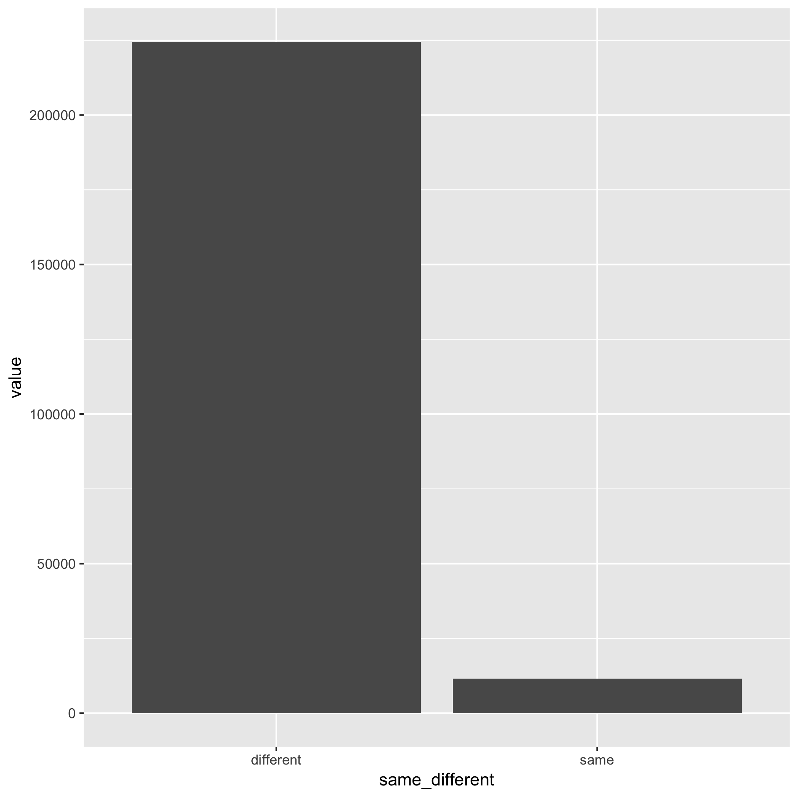
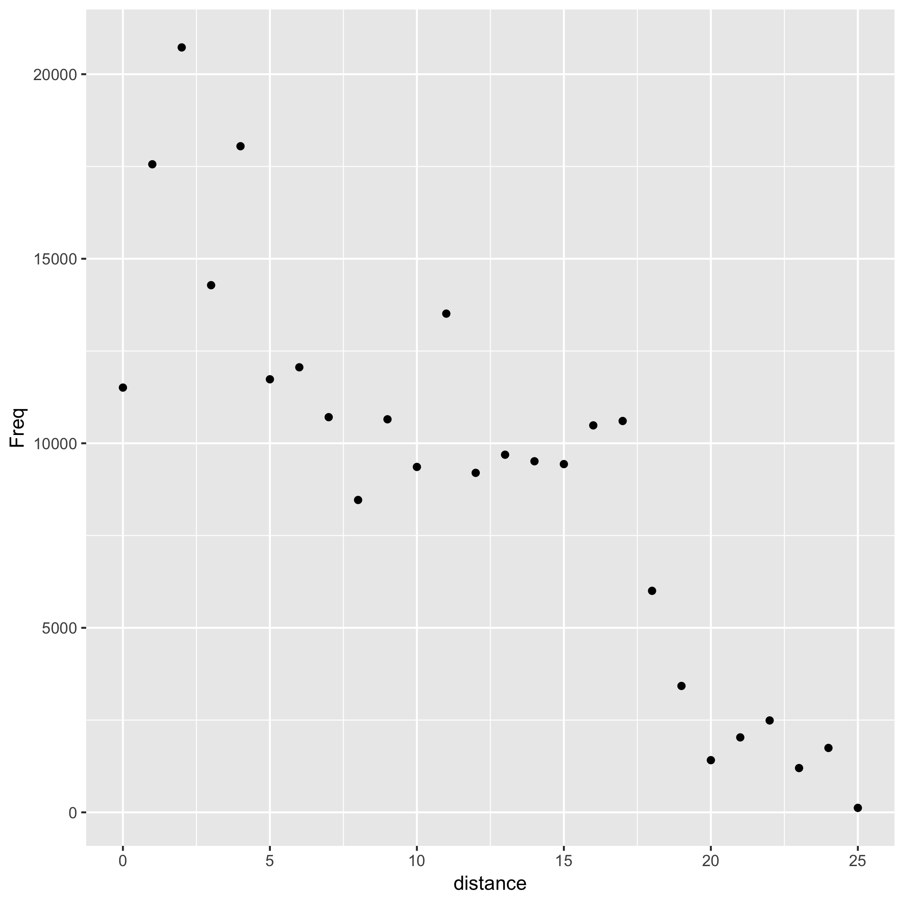

```{r load-data}
data1 <- read.delim("src/distance.tsv")
data2 <- read.delim("src/same_count.tsv")
```

I explored the relationship between the first letter and the last letter of English words. Figure 1 shows how many words in the data has the same starting and ending letter, and how many words has the different ones. Further, for words that have different starting and ending letter, the interval between them is shown in Figure 2. For intance, the interval between letter "a" and "c" is 2.



